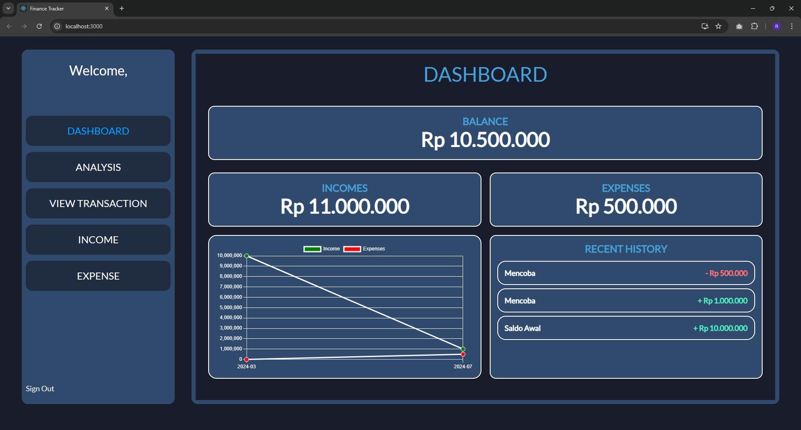
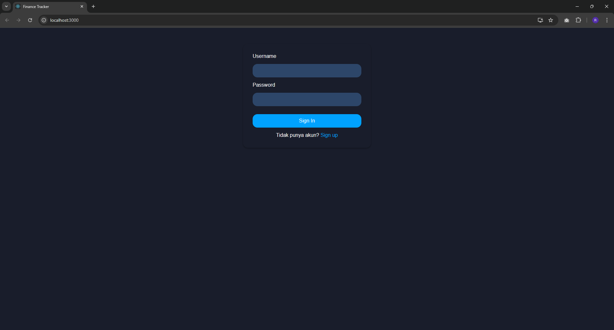
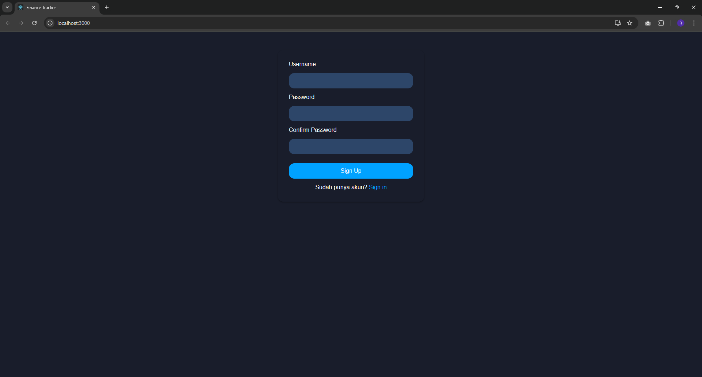
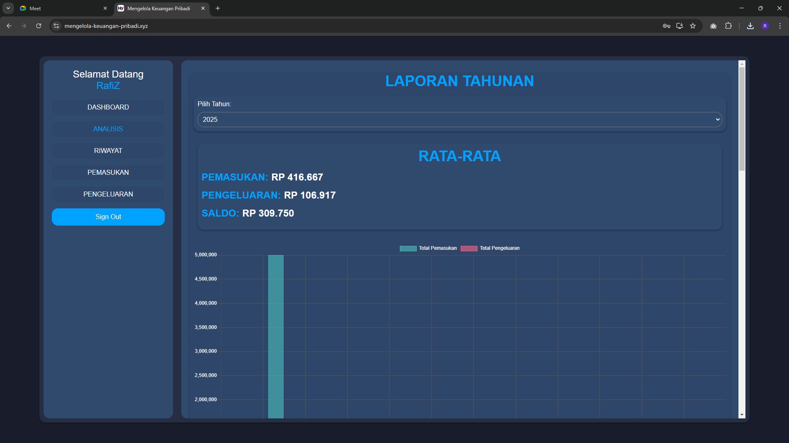
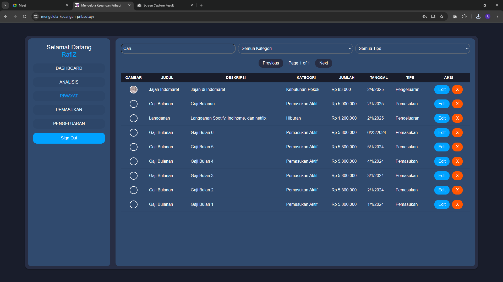
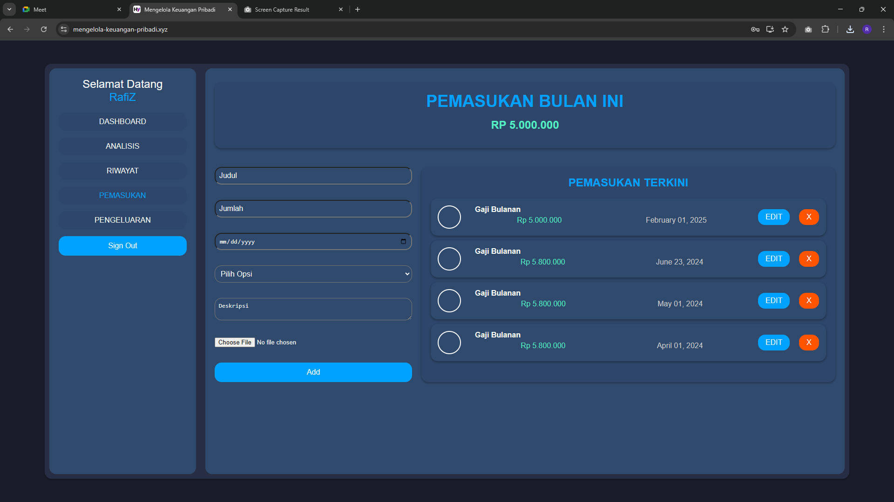
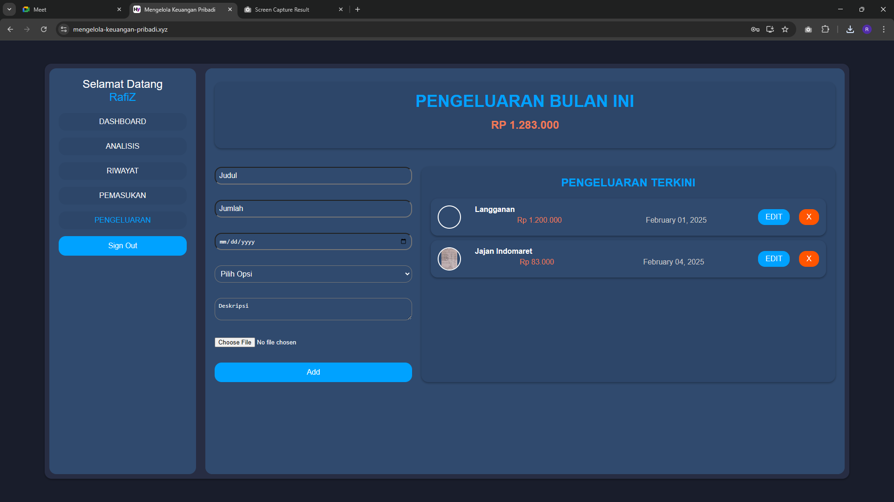

# personal-finance-tracker

This personal project is a webapp for personal finance tracker. this webapp helps users track their income and expenses through a clean and intuitive interface. It includes interactive charts and a detailed transaction history. The project focuses on data visualization and building a reliable system for handling personal financial data securely. This project uses The MERN Stack technology.

---------------

Project Status: The project is fully completed with room for expand.

----------------

Technologies Used

Use MERN Stack Tech
Framwork: Express.js, React.js, Node.js

Database: MongoDB

Programming Language: Javascript

Other Tools: Visual Studio Code, Git

------------

Screenshots

